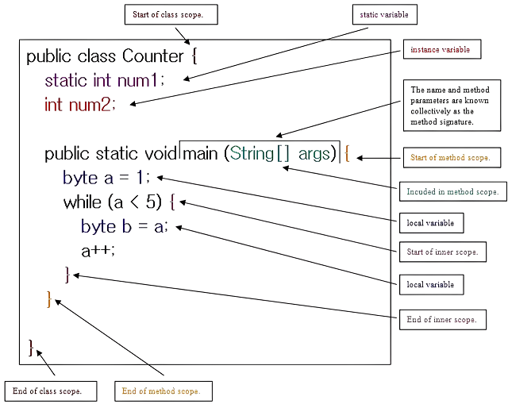

## Java Module Day 5 - Lesson Notes & Code! :)

### Variable Scope



## Boolean Logical Operators

### Introduction
Boolean logical operators are used to form complex logical conditions by combining multiple boolean expressions. These operators are fundamental in controlling the flow of your program through conditional statements and loops.

### Operators

#### AND (&&)
- **Description**: Returns `true` if both operands are `true`.
- **Example**:

```java
boolean result = (5 > 3) && (8 > 6); // true
boolean result2 = (5 > 3) && (8 < 6); // false
```

#### OR (||)
- **Description**: Returns `true` if at least one of the operands is `true`.
- **Example**:

```java
boolean result = (5 > 3) || (8 < 6); // true
boolean result2 = (5 < 3) || (8 < 6); // false
```

#### NOT (!)
- **Description**: Reverses the boolean value of its operand.
- **Example**:

```java
boolean result = !(5 > 3); // false
boolean result2 = !(5 < 3); // true
```

### Combining Logical Operators
Logical operators can be combined to form more complex conditions.

```java
boolean result = (5 > 3) && (8 < 6) || (10 == 10); // true
```

### Short-Circuit Evaluation
- **AND (&&)**: If the first operand is `false`, the second operand is not evaluated.
- **OR (||)**: If the first operand is `true`, the second operand is not evaluated.

```java
boolean result = (5 > 3) && (8 < 6); // false, 8 < 6 is not evaluated
boolean result2 = (5 < 3) || (8 > 6); // true, 8 > 6 is not evaluated
```

### Example
Logical operators are often used in conditional statements such as `if`, `while`, and `for` loops to control the flow of the program.

```java
if ((age >= 18) && (hasLicense)) {
    System.out.println("You can drive.");
}

while (!exitCondition) {
    // loop code
}
```

## Arrays

### Introduction
An array is a data structure that allows you to store multiple values of the same type in a single variable. Arrays are used to organize and manipulate collections of data efficiently.

### Declaration and Initialization

#### Single-Dimensional Array

```java
int[] numbers = new int[5]; // Declaration with size
int[] numbers = {1, 2, 3, 4, 5}; // Declaration with initialization
```

### Accessing Elements
Elements in an array are accessed using their index, with the first element at index `0`.

```java
int firstNumber = numbers[0]; // Access first element
numbers[1] = 10; // Modify second element
```

### Looping Through Arrays

#### One-Dimensional Array

```java
for (int i = 0; i < numbers.length; i++) { // for-loop
    System.out.println(numbers[i]);
}
```

### Array Summary Table

| Feature                  | Description                                  | Example                                             |
|--------------------------|----------------------------------------------|-----------------------------------------------------|
| Declaration              | Define the array                             | `int[] numbers = new int[5];`                       |
| Initialization           | Initialize with values                       | `int[] numbers = {1, 2, 3, 4, 5};`                  |
| Accessing Elements       | Access via index                             | `int firstNumber = numbers[0];`                     |
| Modifying Elements       | Modify via index                             | `numbers[1] = 10;`                                  |

### Visual Representation of an Array
Here’s how an array looks in memory, represented in a table:

| Index       | 0   | 1   | 2   | 3   | 4   |
|-------------|-----|-----|-----|-----|-----|
| `numbers`   | 1   | 2   | 3   | 4   | 5   |

### Example

```java
public class Main {
    public static void main(String[] args) {
        // Declare and initialize an array
        int[] numbers = {10, 20, 30, 40, 50};

        // Iterate through the array using a for loop
        for (int i = 0; i < numbers.length; i++) {
            System.out.println("Element at index " + i + ": " + numbers[i]);
        }
    }
}
```
