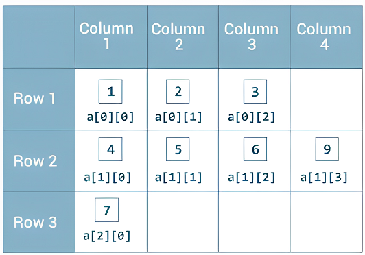
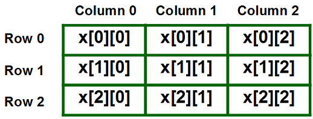
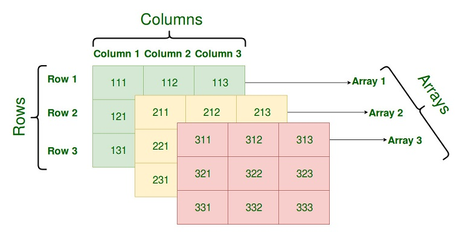

## Java Module Day 8 - Lesson Notes & Code! :)

## Multi-dimensional Arrays







### Example: Basic Two-Dimensional Array

```java
public class Main {
    public static void main(String[] args) {
        int[][] arr = {
                        {1, 2},
                        {3, 4}
                      };
        /*
            arr[0][0]= 1
            arr[0][1]= 2
            arr[1][0]= 3
            arr[1][1]= 4
         */

        for(int i = 0; i < 2; i++) {
            for(int j = 0; j < 2; j++) {
                System.out.println(arr[i][j]);
            }
            System.out.println();
        }
    }
}
```

- Multidimensional arrays in Java can be initialized with predefined values.
- Use nested loops to iterate and print elements of the array.
- `arr[i][j]` is used to access the element in the i-th row and j-th column.

### Example: Multidimensional Array with Different Number of Rows

```java
public class Main {
    public static void main(String[] args) {
        int[][] arr2 = {{1, 2}, {3, 4}, {5, 6}};
        for(int[] row: arr2){
            for(int num: row){
                System.out.println(num + " ");
            }
            System.out.println();
        }
    }
}
```

- Arrays can have a varying number of rows.
- Enhanced for-loops (for-each loops) can be used to iterate through the array.

### Example: Iterating Over a String Array with For-Each Loops

```java
public class Main {
    public static void main(String[] args) {
        String[] animals = {"cat", "dog", "sloth", "elephant"};

        for(String animal:animals){
            System.out.println(animal);
        }
    }
}
```

- Enhanced for-loops are used to iterate over each element in the array.

### Example: Dynamic Multidimensional Array Input

```java
import java.util.Scanner;

public class Main {
    public static void main(String[] args) {

        Scanner scanner = new Scanner(System.in);
        
	System.out.println("Please enter the number of rows: ");
        int rows = scanner.nextInt();
        System.out.println("Please enter the number of columns: ");
        int columns = scanner.nextInt();

        int[][] multiDimensionalArray = new int[rows][columns];

        for(int[] row : multiDimensionalArray) {
            for(int num: row){
                System.out.print(num + " ");
            }
            System.out.println();
        }
        scanner.close();
    }
}
```
- User input can be used to dynamically define the size of a multidimensional array.
- The `Scanner` class is used to take input from the user.
- Nested for-each-loops can be used to iterate and print the array elements.


### Example: Finding the Maximum Value in an Array

```java
public class Main {
    public static void main(String[] args) {
        int[] score = {125, 182, 95, 116, 154};

        int highestScore = maxScore(score);
        System.out.println("The highest score is: " + highestScore);
    }

    public static int maxScore(int[] numbers) {
        int maxSoFar = numbers[0];

        for(int num: numbers){
            if(num > maxSoFar){
                maxSoFar = num;
            }
        }
        return maxSoFar;
    }
}
```

- The `maxScore` method demonstrates how to find the maximum value in an array.
- Initialize the maximum value with the first element of the array.
- Use a for-loop to iterate through the array and update the maximum value if a larger value is found.
- Return the maximum value after the loop completes.
