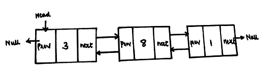
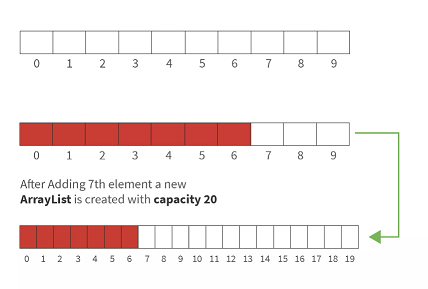

## Java Module Day 14 - Lesson Notes & Code! :)

### 1. **LinkedList vs. ArrayList**

Both `LinkedList` and `ArrayList` are implementations of the `List` interface in Java, but they have different underlying data structures, which lead to distinct performance characteristics.

### LinkedList:


  
  - Implemented as a **doubly linked list**. Each element (node) contains references to both the previous and next nodes.
  - **Performance Characteristics**:
    - **Insertion/Deletion**:
      - **Faster**, when adding/removing elements.
    - **Access Time**:
      - **Longer**, as it requires traversal from the beginning or end to reach the desired element.
  - **Memory Usage**: Higher memory overhead due to the storage of two references (previous and next node) per element.

### ArrayList:

 
 
  - Implemented as a **resizable array**. It dynamically grows as elements are added.
  - **Performance Characteristics**:
    - **Insertion/Deletion**:
      - **Slower**, when adding/removing elements.
    - **Access Time**:
      - **Faster**, for random access, as elements are indexed directly.
  - **Memory Usage**: Lower memory overhead compared to `LinkedList`, but it may allocate extra space to accommodate future elements, leading to temporary unused capacity.

### 2. **List Interface**
   - Both `LinkedList` and `ArrayList` implement the `List` interface, allowing them to be used interchangeably when only list operations are required.
   - **Common methods** include `add()`, `get()`, `remove()`, `size()`, and `contains()`.

### 3. **Basic Operations on LinkedList**

   ```java
   LinkedList<String> list = new LinkedList<>();
   list.add("Item 1");
   list.add("Item 2");
   list.add("Item 3");
   ```

   - **Adding Elements**: Elements are added to the `LinkedList` using the `add()` method. It’s efficient when adding at the beginning or end of the list.
   - **Iteration**: The code demonstrates iterating over the `LinkedList` using an enhanced `for` loop.
   - **Retrieving Elements**: The `get(int index)` method allows retrieval of elements by their position in the list, but it has linear time complexity.

### 4. **Shuffling a List**

   ```java
   Collections.shuffle(numbers);
   ```

   - **`Collections.shuffle()`**: This method randomizes the order of elements in a list, which can be useful in scenarios like games or simulations where random ordering is needed. The operation is the same for both `ArrayList` and `LinkedList`, but since it involves accessing elements frequently, it can be slower on a `LinkedList`.

### 5. **Using the `showList` Method**

   ```java
   public static void showList(List<Integer> list){
       for(Integer number : list) {
           System.out.println(number);
       }
   }
   ```

   - **Reusable Method**: The `showList` method is a simple example of how to create a reusable method that can accept any `List` of integers, regardless of whether it is an `ArrayList` or `LinkedList`.

### 6. Additional LinkedList Methods
   - `getFirst()` and `getLast()`: Retrieve the first and last elements of the `LinkedList`.
   - `addFirst(E element)` and `addLast(E element)`: Add elements to the beginning or end of the list.
   - `removeFirst()` and `removeLast()`: Remove elements from the beginning or end of the list.
   - `clear()`: Removes all elements from the list.

### When to Use `ArrayList`:
- **Frequent Random Access**: If your application requires frequent access to elements by index, `ArrayList` is the preferred choice.
- **Memory Efficiency**: `ArrayList` generally uses less memory because it doesn't need to store additional pointers for each element.

### When to Use `LinkedList`:
- **Frequent Insertions/Deletions**: If your application frequently adds or removes elements from the beginning or middle of the list, `LinkedList` is more efficient.
- **Memory Trade-Off**: While `LinkedList` consumes more memory due to additional pointers, it avoids the cost of resizing that occurs in `ArrayList`.

### Limitations:
- **`LinkedList`**:
  - Poor cache performance due to non-contiguous memory allocation, which can make it slower in practice for large datasets, despite having good time complexity for certain operations.
  - Higher memory usage due to the need to store two extra references per element.
- **`ArrayList`**:
  - Resizing the array when it reaches capacity can be expensive in terms of time and memory.
  - Insertions and deletions in the middle of the list are slow due to the need to shift elements.

## Code Example

### Initializing and Adding Elements to a LinkedList
```java
LinkedList<String> list = new LinkedList<>();

list.add("Item 1");
list.add("Item 2");
list.add("Item 3");
```

### Iterating Over a LinkedList
```java
for(String item : list) {
    System.out.println(item);
}
```
- This loop prints out each item in the `LinkedList`.

### Using LinkedList with Integers
```java
List<Integer> numbers = new LinkedList<>();

numbers.add(1);
numbers.add(53);
numbers.add(125);

System.out.println(numbers.get(1));
Collections.shuffle(numbers);
```
- Here, we create a `LinkedList` of integers, add some numbers, retrieve an element at index 1, and then shuffle the list.

### Demonstrating Polymorphism with `showList`
```java
public static void showList(List<Integer> list){
        for(Integer number : list) {
            System.out.println(number);
        }
    }
```

```java
List<Integer> numbers = new LinkedList<>();
numbers.add(12);
numbers.add(53);
numbers.add(190);

List<Integer> numbersList2 = new ArrayList<>();
numbersList2.add(1);
numbersList2.add(10);
numbersList2.add(150);

showList(numbers);
showList(numbersList2);
```
- This demonstrates how the `showList` method can be used with both `LinkedList` and `ArrayList` due to their common `List` interface. The method doesn't need to know the specific type of list; it works with any implementation.
