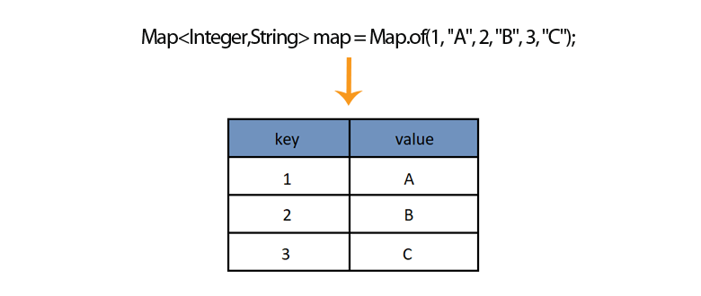

## Java Module Day 17 - Lesson Notes & Code! :)

### HashMap

In this lesson, we explored the `HashMap` class in Java, which is a part of the Java Collections Framework.



A `HashMap` is a data structure that stores key-value pairs. It is part of the `java.util` package and implements the `Map` interface. The primary features of a `HashMap` include:

- **Fast Access**: It provides constant-time performance for the basic operations (`get` and `put`).
- **Key-Value Mapping**: Each key is associated with one value, and each key can only appear once in the map. If you try to insert a duplicate key, the new value will replace the old value.

### Key Characteristics
- **Order**: `HashMap` does not maintain any order of its elements (neither insertion order nor any sorted order).
- **Null Values**: `HashMap` allows one `null` key and multiple `null` values.

### Code Example

```java
import java.util.HashMap;
import java.util.Map;

public class Main {
    public static void main(String[] args) {
        // Key  ,  Value
        HashMap<Integer, String> employeeId = new HashMap<>();

        employeeId.put(6354, "John");
        employeeId.put(1325, "Susan");
        employeeId.put(6541, "Joe");
        employeeId.put(9642, "Bob");
        employeeId.put(9642, "Paula");

        System.out.println(employeeId);
        System.out.println(employeeId.get(6354));
        System.out.println(employeeId.containsKey(1325));
        System.out.println(employeeId.containsValue("George"));

        employeeId.put(6541, "Joy");
        employeeId.putIfAbsent(3216, "Angela");
        employeeId.remove(9642);
        System.out.println(employeeId);

        for (Map.Entry<Integer, String> entry : employeeId.entrySet()) {
            System.out.println(entry.getKey() + " " + entry.getValue());
        }
    }
}
```

### Key Points and Takeaways

1. **Creating a `HashMap`**:
    ```java
    HashMap<Integer, String> employeeId = new HashMap<>();
    ```
    - Here, we create a `HashMap` where the key is of type `Integer` and the value is of type `String`.

2. **Inserting Elements**:
    ```java
    employeeId.put(6354, "John");
    employeeId.put(1325, "Susan");
    employeeId.put(6541, "Joe");
    employeeId.put(9642, "Bob");
    employeeId.put(9642, "Paula");
    ```
    - The `put()` method adds key-value pairs to the `HashMap`.
    - Note: Inserting a value with an existing key (`9642`) will replace the old value ("Bob") with the new one ("Paula").

3. **Accessing Elements**:
    ```java
    System.out.println(employeeId.get(6354));
    ```
    - The `get()` method retrieves the value associated with the specified key (`6354`). In this case, it will print `"John"`.

4. **Checking for Keys/Values**:
    ```java
    System.out.println(employeeId.containsKey(1325));
    System.out.println(employeeId.containsValue("George"));
    ```
    - `containsKey()` checks if a specific key (`1325`) exists in the `HashMap`.
    - `containsValue()` checks if a specific value (`"George"`) is present in the `HashMap`.

5. **Updating Elements**:
    ```java
    employeeId.put(6541, "Joy");
    ```
    - This updates the value associated with the key `6541` from `"Joe"` to `"Joy"`.

6. **Adding Elements Conditionally**:
    ```java
    employeeId.putIfAbsent(3216, "Angela");
    ```
    - `putIfAbsent()` inserts the key-value pair only if the key is not already present in the `HashMap`.

7. **Removing Elements**:
    ```java
    employeeId.remove(9642);
    ```
    - The `remove()` method deletes the entry with the specified key (`9642`).

8. **Iterating Over a `HashMap`**:
    ```java
    for (Map.Entry<Integer, String> entry : employeeId.entrySet()) {
        System.out.println(entry.getKey() + " " + entry.getValue());
    }
    ```
    - We use a `for-each` loop to iterate over the entries in the `HashMap`. The `entrySet()` method returns a set of key-value pairs (`Map.Entry` objects), which we can then loop through.

### Summary of important Methods of `HashMap`

- `put(K key, V value)`: Inserts or updates the key-value pair.
- `get(Object key)`: Returns the value associated with the specified key, or `null` if the key does not exist.
- `remove(Object key)`: Removes the key-value pair associated with the specified key.
- `containsKey(Object key)`: Checks if the map contains the specified key.
- `containsValue(Object value)`: Checks if the map contains the specified value.
- `putIfAbsent(K key, V value)`: Inserts the key-value pair only if the key is not already present in the map.
- `entrySet()`: Returns a `Set` view of the mappings contained in this map.
